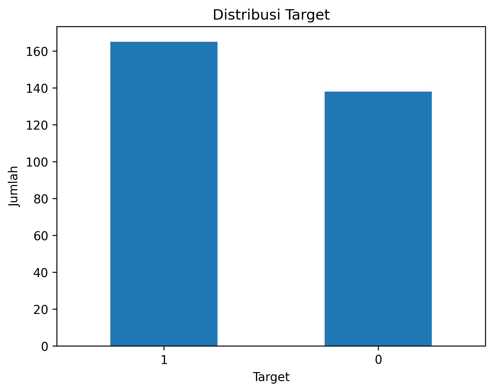
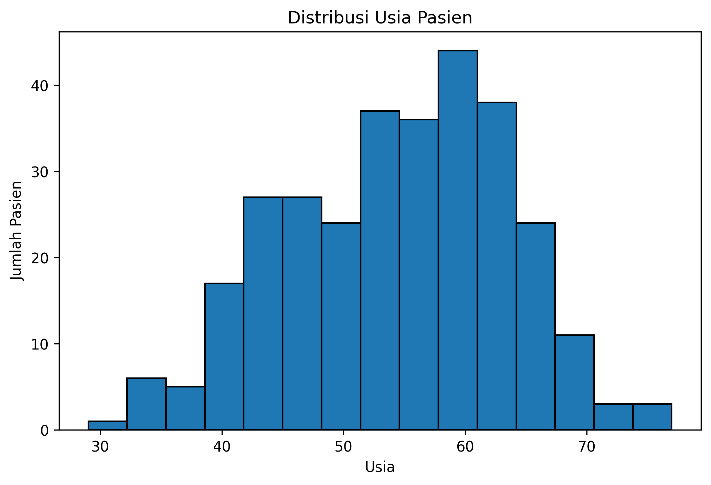
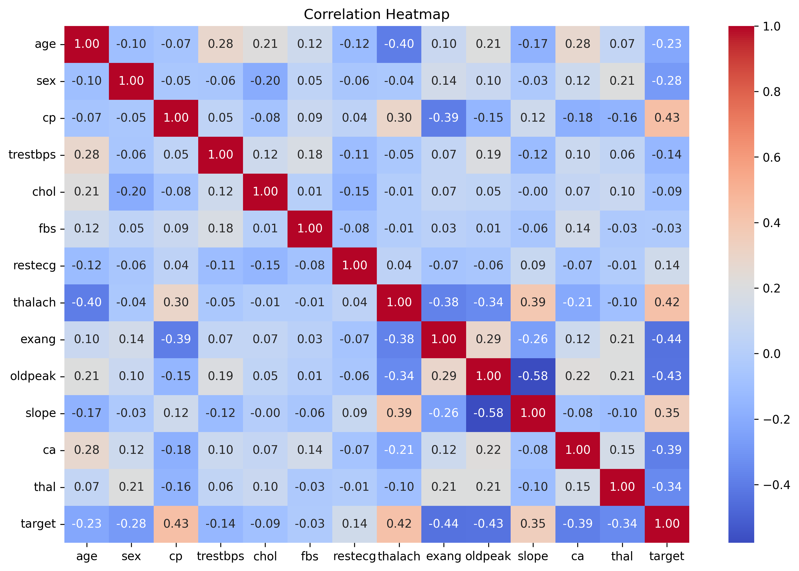
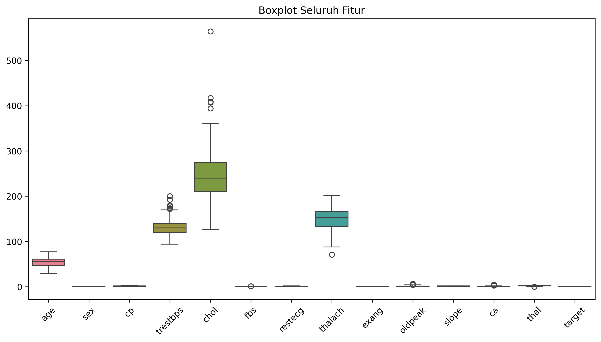
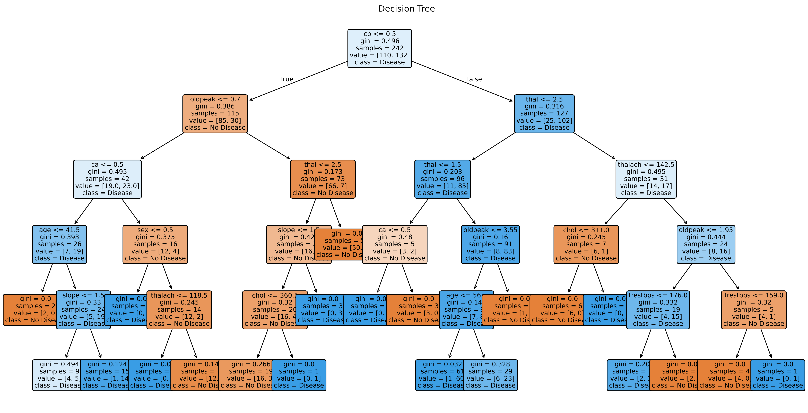
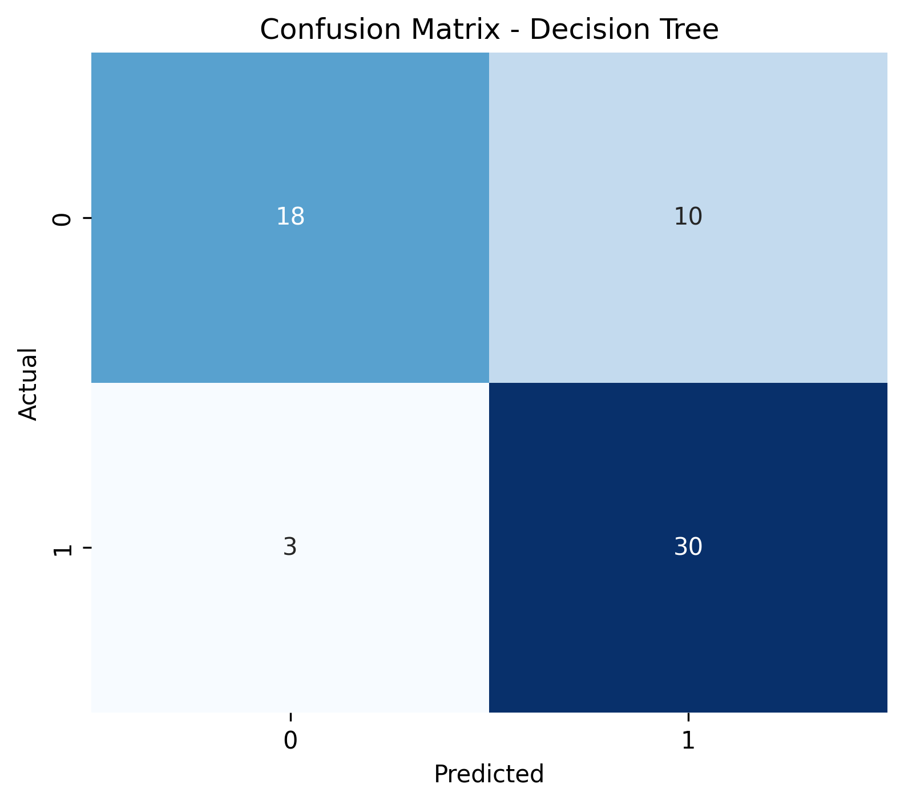
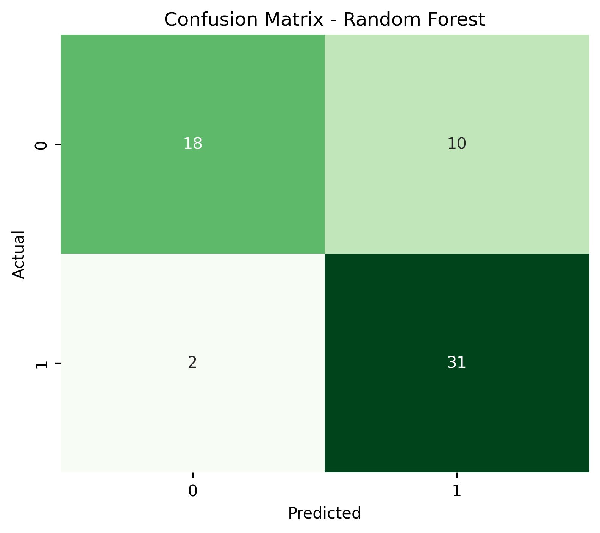

# Laporan UAS Kecerdasan Buatan

---

# 1. Judul Proyek

## 1.1 Judul
Analisis Klasifikasi Risiko Penyakit Jantung Menggunakan Algoritma Decision Tree dan Random Forest

## 1.2 Nama Kelompok

| Nama | NIM |
|------|-----|
| Aina Anastasya | 2406123 |

## 1.3 Domain Proyek (Latar Belakang)

Penyakit jantung merupakan salah satu penyebab utama kematian di dunia menurut World Health Organization (WHO) [6], termasuk Indonesia. Banyak kasus penyakit jantung baru terdeteksi ketika kondisi pasien telah memasuki tahap yang lebih serius. Keterlambatan diagnosis dapat mengurangi peluang keberhasilan pengobatan serta meningkatkan risiko komplikasi. Oleh karena itu, diperlukan suatu pendekatan yang dapat membantu proses identifikasi risiko penyakit jantung secara lebih cepat dan akurat.

Perkembangan teknologi Artificial Intelligence (AI), khususnya Machine Learning telah banyak dimanfaatkan dalam bidang kesehatan untuk membantu proses prediksi dan pengambilan keputusan klinis [2]. Dengan memanfaatkan data seperti usia, tekanan darah, kadar kolesterol, detak jantung maksimum, serta faktor kesehatan lainnya, model machine learning dapat membantu mengklasifikasikan apakah seseorang berisiko mengalami penyakit jantung.

Pada proyek ini digunakan **Heart Disease UCI Dataset** yang diperoleh melalui Kaggle. Dataset tersebut berisi data klinis pasien yang telah banyak digunakan dalam penelitian klasifikasi penyakit jantung. Dua algoritma klasifikasi, yaitu **Decision Tree** dan **Random Forest**, dipilih karena memiliki kemampuan dalam menangani data klasifikasi, mudah diimplementasikan, serta dapat dibandingkan performanya untuk menentukan model yang memberikan hasil prediksi terbaik.

Melalui proyek ini diharapkan dapat diperoleh model klasifikasi yang mampu membantu proses prediksi risiko penyakit jantung secara efektif. Selain itu, hasil penelitian ini juga menjadi sarana penerapan konsep machine learning dalam menyelesaikan permasalahan nyata di bidang kesehatan.

# 2. Business Understanding

## 2.1 Permasalahan Dunia Nyata

Penyakit jantung merupakan salah satu penyakit tidak menular yang memiliki angka kematian tinggi di dunia. Banyak penderita baru mengetahui kondisi penyakitnya setelah gejala yang dialami sudah cukup serius, sehingga proses penanganan menjadi lebih sulit. Kondisi ini menunjukkan pentingnya upaya deteksi dini agar risiko penyakit jantung dapat diketahui lebih awal [1].

Di sisi lain, perkembangan teknologi Artificial Intelligence (AI), khususnya Machine Learning, memberikan peluang untuk membantu proses identifikasi risiko penyakit jantung berdasarkan data medis pasien [1],[2]. Dengan memanfaatkan data seperti usia, tekanan darah, kadar kolesterol, denyut jantung maksimum, serta beberapa indikator kesehatan lainnya, sistem dapat mempelajari pola-pola tertentu yang berkaitan dengan risiko penyakit jantung. Hasil prediksi tersebut dapat digunakan sebagai pendukung dalam proses pengambilan keputusan oleh tenaga medis, meskipun tidak menggantikan diagnosis dokter.

---

## 2.2 Literature Review

Berbagai penelitian telah menunjukkan bahwa algoritma Machine Learning mampu memberikan performa yang baik dalam klasifikasi penyakit jantung [1],[2],[3]. Algoritma seperti Decision Tree dan Random Forest banyak digunakan karena mampu menangani data klasifikasi dengan baik, mudah diinterpretasikan, serta memiliki tingkat akurasi yang tinggi pada berbagai dataset kesehatan.

Decision Tree bekerja dengan membentuk struktur pohon keputusan berdasarkan atribut yang paling berpengaruh terhadap target klasifikasi. Sementara itu, Random Forest merupakan metode ensemble yang menggabungkan banyak Decision Tree sehingga mampu meningkatkan stabilitas model serta mengurangi risiko overfitting [3],[4].

Pada penelitian ini, kedua algoritma tersebut akan dibandingkan untuk mengetahui algoritma mana yang memberikan performa terbaik pada Heart Disease UCI Dataset [1],[2].

---

## 2.3 Tujuan Proyek

Tujuan dari proyek ini adalah:

1. Membangun model klasifikasi risiko penyakit jantung menggunakan algoritma Decision Tree.
2. Membangun model klasifikasi risiko penyakit jantung menggunakan algoritma Random Forest.
3. Membandingkan performa kedua algoritma berdasarkan metrik Accuracy, Precision, Recall, F1-Score, dan Confusion Matrix.
4. Menentukan algoritma yang memberikan performa terbaik dalam mengklasifikasikan risiko penyakit jantung.

---

## 2.4 Pengguna Sistem

Sistem klasifikasi yang dibangun pada penelitian ini ditujukan untuk beberapa pengguna, yaitu:

- Tenaga medis sebagai alat bantu dalam melakukan identifikasi awal terhadap risiko penyakit jantung.
- Peneliti yang ingin melakukan analisis atau pengembangan model klasifikasi penyakit jantung.
- Mahasiswa atau akademisi sebagai media pembelajaran penerapan Machine Learning pada bidang kesehatan.

Perlu diperhatikan bahwa sistem ini hanya berfungsi sebagai alat bantu prediksi dan tidak dimaksudkan untuk menggantikan diagnosis maupun keputusan klinis dari tenaga medis.

---

## 2.5 Solusi dan Manfaat Implementasi AI

Implementasi Artificial Intelligence pada proyek ini memberikan solusi berupa sistem klasifikasi yang mampu memprediksi risiko penyakit jantung berdasarkan data pasien [2],[3]. Dengan menggunakan algoritma Decision Tree dan Random Forest, model dapat mengenali pola dari data historis dan menghasilkan prediksi secara otomatis.

Adapun manfaat dari implementasi AI pada penelitian ini antara lain:

- Membantu proses identifikasi awal risiko penyakit jantung.
- Mempercepat proses analisis data pasien.
- Menjadi alat pendukung pengambilan keputusan bagi tenaga medis.
- Menjadi media pembelajaran penerapan Machine Learning dalam bidang kesehatan.
- Memberikan perbandingan performa antara algoritma Decision Tree dan Random Forest sehingga dapat diketahui algoritma yang lebih sesuai untuk dataset yang digunakan.

# 3. Data Understanding

## 3.1 Sumber Data

Dataset yang digunakan dalam penelitian ini adalah **Heart Disease UCI Dataset** yang diperoleh melalui platform Kaggle. Dataset ini berasal dari UCI Machine Learning Repository dan telah banyak digunakan sebagai dataset acuan dalam penelitian mengenai klasifikasi penyakit jantung menggunakan metode machine learning [5].

Dataset tersebut berisi data medis pasien yang mencakup beberapa parameter kesehatan, seperti usia, jenis kelamin, tekanan darah, kadar kolesterol, hasil elektrokardiografi, serta indikator kesehatan lainnya yang digunakan untuk memprediksi risiko penyakit jantung [5].

Link Kaggle: https://www.kaggle.com/datasets/hartman/heart-disease-uci

---

## 3.2 Deskripsi Dataset

Karakteristik dataset yang digunakan adalah sebagai berikut.

| Keterangan | Nilai |
|------------|--------|
| Nama Dataset | Heart Disease UCI |
| Jumlah Data | 303 data pasien |
| Jumlah Fitur | 13 fitur prediktor |
| Jumlah Target | 1 target klasifikasi |
| Total Kolom | 14 kolom |
| Format Data | CSV (.csv) |
| Jenis Masalah | Klasifikasi Biner |

Target pada dataset terdiri dari dua kelas, yaitu:

- **0** : Tidak berisiko penyakit jantung
- **1** : Berisiko penyakit jantung

Informasi mengenai karakteristik dataset mengacu pada dokumentasi resmi Heart Disease UCI Dataset [5].

---

## 3.3 Deskripsi Setiap Atribut

Dataset terdiri dari 13 atribut prediktor dan 1 atribut target. Penjelasan masing-masing atribut dapat dilihat pada tabel berikut.

| No | Nama Atribut | Deskripsi |
|----|--------------|-----------|
| 1 | age | Usia pasien (tahun). |
| 2 | sex | Jenis kelamin pasien (1 = laki-laki, 0 = perempuan). |
| 3 | cp | Jenis nyeri dada (Chest Pain Type). |
| 4 | trestbps | Tekanan darah saat istirahat (mmHg). |
| 5 | chol | Kadar kolesterol dalam darah (mg/dL). |
| 6 | fbs | Kadar gula darah puasa (>120 mg/dL). |
| 7 | restecg | Hasil pemeriksaan elektrokardiografi saat istirahat. |
| 8 | thalach | Denyut jantung maksimum yang dicapai. |
| 9 | exang | Indikasi angina akibat olahraga. |
| 10 | oldpeak | Depresi segmen ST akibat olahraga dibandingkan kondisi istirahat. |
| 11 | slope | Kemiringan segmen ST saat olahraga. |
| 12 | ca | Jumlah pembuluh darah utama yang terdeteksi melalui fluoroskopi. |
| 13 | thal | Hasil pemeriksaan Thalassemia. |
| 14 | target | Label klasifikasi risiko penyakit jantung. |

Penjelasan atribut pada penelitian ini mengacu pada dokumentasi resmi Heart Disease UCI Dataset [5].

---

## 3.4 Tipe Data

Berdasarkan hasil eksplorasi dataset menggunakan fungsi `df.info()`, seluruh atribut pada dataset memiliki tipe data numerik sehingga tidak diperlukan proses konversi tipe data sebelum dilakukan pemodelan.

Dataset terdiri atas data bertipe integer (`int64`) dan floating point (`float64`). Hal ini memudahkan proses analisis karena algoritma Decision Tree dan Random Forest dapat langsung memproses data numerik tanpa memerlukan encoding tambahan.

---

## 3.5 Target Klasifikasi

Variabel target pada penelitian ini adalah **target**, yang digunakan sebagai label dalam proses klasifikasi.

Penjelasan target adalah sebagai berikut.

| Nilai | Keterangan |
|--------|------------|
| 0 | Tidak berisiko penyakit jantung |
| 1 | Berisiko penyakit jantung |

Model machine learning akan mempelajari hubungan antara ketiga belas atribut prediktor dengan variabel target untuk menghasilkan prediksi mengenai risiko penyakit jantung pada data baru.

# 4. Exploratory Data Analysis (EDA)

## 4.1 Tujuan Exploratory Data Analysis

Exploratory Data Analysis (EDA) dilakukan untuk memahami karakteristik dataset sebelum proses pemodelan machine learning. Pada tahap ini dilakukan analisis terhadap distribusi data, hubungan antar atribut, keseimbangan kelas target, serta identifikasi pola-pola awal yang terdapat pada dataset. Hasil EDA menjadi dasar dalam menentukan proses persiapan data dan pemilihan algoritma klasifikasi.

---

## 4.2 Distribusi Target

Visualisasi distribusi target dilakukan untuk mengetahui jumlah data pada masing-masing kelas, yaitu pasien yang tidak berisiko penyakit jantung (0) dan pasien yang berisiko penyakit jantung (1).

### Analisis

Berdasarkan visualisasi distribusi target, terlihat bahwa jumlah data pada kedua kelas relatif seimbang. Hal ini menunjukkan bahwa dataset tidak mengalami ketidakseimbangan kelas (class imbalance) yang signifikan, sehingga model machine learning dapat dilatih tanpa memerlukan teknik penyeimbangan data seperti oversampling maupun undersampling.

---

## 4.3 Distribusi Setiap Fitur

Untuk memahami karakteristik masing-masing atribut, dilakukan visualisasi menggunakan histogram. Visualisasi ini membantu melihat penyebaran nilai setiap fitur serta mendeteksi kemungkinan adanya outlier atau distribusi yang tidak normal.

### Analisis

Histogram menunjukkan bahwa setiap atribut memiliki pola distribusi yang berbeda. Beberapa atribut memiliki distribusi yang mendekati normal, sedangkan atribut lainnya cenderung tidak simetris. Perbedaan distribusi ini merupakan hal yang wajar pada data medis dan tidak menjadi kendala bagi algoritma Decision Tree maupun Random Forest.

---

## 4.4 Analisis Korelasi Antar Fitur

Untuk mengetahui hubungan antar atribut numerik digunakan visualisasi heatmap berdasarkan nilai korelasi.

### Analisis

Heatmap menunjukkan tingkat korelasi antar fitur dalam dataset. Sebagian besar atribut memiliki korelasi rendah hingga sedang terhadap atribut lainnya. Variabel target menunjukkan hubungan yang cukup kuat dengan beberapa fitur, seperti `cp`, `thalach`, `exang`, `oldpeak`, `ca`, dan `thal`, sehingga atribut-atribut tersebut diperkirakan memiliki kontribusi penting dalam proses klasifikasi.

---

## 4.5 Deteksi Outlier

Analisis outlier dilakukan menggunakan boxplot untuk melihat apakah terdapat nilai ekstrem pada beberapa atribut numerik.

****

### Analisis

Hasil boxplot menunjukkan adanya beberapa nilai ekstrem pada atribut seperti `chol`, `trestbps`, dan `oldpeak`. Namun, nilai-nilai tersebut masih dianggap sebagai bagian dari kondisi medis pasien sehingga tidak dihapus dari dataset. Selain itu, algoritma Decision Tree dan Random Forest relatif tahan terhadap keberadaan outlier sehingga data tetap digunakan pada proses pemodelan.

---

## 4.6 Insight Awal Dataset

Berdasarkan hasil Exploratory Data Analysis dapat diperoleh beberapa insight sebagai berikut.

- Dataset memiliki distribusi kelas target yang relatif seimbang.
- Tidak ditemukan indikasi masalah serius pada distribusi data.
- Beberapa atribut memiliki hubungan yang cukup kuat terhadap variabel target.
- Dataset telah memiliki kualitas yang baik untuk digunakan pada proses pemodelan tanpa memerlukan preprocessing yang kompleks.
- Algoritma Decision Tree dan Random Forest dipilih karena mampu menangani data numerik, tidak memerlukan normalisasi, serta cukup robust terhadap outlier.

# 5. Data Preparation

## 5.1 Pembersihan Data (Data Cleaning)

Tahap pertama pada data preparation adalah melakukan pemeriksaan kualitas data. Pemeriksaan dilakukan untuk memastikan bahwa dataset layak digunakan dalam proses pemodelan machine learning.

Berdasarkan hasil pemeriksaan, dataset **tidak memiliki missing value** pada seluruh atribut. Selain itu, hasil pengecekan juga menunjukkan bahwa **tidak terdapat data duplikat**, sehingga tidak diperlukan proses penghapusan ataupun imputasi data.

Dengan demikian, dataset dapat langsung digunakan pada tahap selanjutnya tanpa proses pembersihan tambahan.

---

## 5.2 Encoding Data

Encoding merupakan proses mengubah data kategorikal menjadi bentuk numerik agar dapat diproses oleh algoritma machine learning.

Pada dataset Heart Disease UCI yang digunakan dalam penelitian ini, seluruh atribut telah direpresentasikan dalam bentuk numerik. Oleh karena itu, **tidak dilakukan proses encoding**, karena algoritma Decision Tree dan Random Forest dapat langsung memproses data tersebut.

---

## 5.3 Normalisasi Data

Normalisasi atau standarisasi umumnya dilakukan pada algoritma yang sensitif terhadap skala data, seperti K-Nearest Neighbor (KNN) atau Support Vector Machine (SVM).

Pada penelitian ini **tidak dilakukan proses normalisasi maupun standarisasi**, karena algoritma Decision Tree dan Random Forest bekerja berdasarkan proses pembentukan pohon keputusan sehingga tidak dipengaruhi oleh perbedaan skala antar fitur.

---

## 5.4 Pemisahan Data (Train-Test Split)

Setelah data dipastikan siap digunakan, dilakukan pemisahan dataset menjadi data latih (*training set*) dan data uji (*testing set*).

Pembagian data dilakukan menggunakan fungsi `train_test_split()` dari pustaka Scikit-learn dengan komposisi:

- Data Training : 80%
- Data Testing : 20%
- random_state = 42

Data latih digunakan untuk membangun model klasifikasi, sedangkan data uji digunakan untuk mengevaluasi performa model terhadap data yang belum pernah dipelajari sebelumnya.

---

## 5.5 Hasil Data Preparation

Berdasarkan tahapan data preparation yang telah dilakukan, diperoleh beberapa hasil sebagai berikut.

- Dataset tidak memiliki missing value.
- Dataset tidak memiliki data duplikat.
- Tidak diperlukan proses encoding karena seluruh atribut telah berupa data numerik.
- Tidak dilakukan normalisasi karena algoritma yang digunakan tidak memerlukan proses tersebut.
- Dataset berhasil dibagi menjadi data training dan data testing dengan perbandingan 80:20.

# 6. Modeling

## 6.1 Pemilihan Algoritma

Pada penelitian ini digunakan dua algoritma klasifikasi, yaitu **Decision Tree** dan **Random Forest**. Kedua algoritma dipilih karena mampu menangani permasalahan klasifikasi dengan baik, mudah diimplementasikan menggunakan Scikit-learn, serta banyak digunakan dalam penelitian pada bidang kesehatan.

Decision Tree dipilih karena menghasilkan model yang mudah dipahami melalui struktur pohon keputusan. Sementara itu, Random Forest dipilih karena merupakan pengembangan dari Decision Tree yang menggabungkan banyak pohon keputusan (*ensemble learning*) sehingga mampu meningkatkan performa prediksi dan mengurangi risiko *overfitting*.

---

## 6.2 Alasan Pemilihan Algoritma

Pemilihan Decision Tree dan Random Forest didasarkan pada beberapa pertimbangan berikut.

- Keduanya merupakan algoritma klasifikasi yang sesuai untuk data biner.
- Tidak memerlukan proses normalisasi data.
- Mampu menangani data numerik secara langsung.
- Mudah diimplementasikan menggunakan Scikit-learn.
- Memungkinkan dilakukan perbandingan performa untuk menentukan model terbaik.

---

## 6.3 Implementasi Model Decision Tree

Tahap pertama adalah membangun model menggunakan algoritma Decision Tree.

Model dibuat menggunakan `DecisionTreeClassifier()` dari Scikit-learn dan dilatih menggunakan data training yang telah dipersiapkan pada tahap sebelumnya.

[dt_model = DecisionTreeClassifier(
    criterion="gini",
    max_depth=5,
    random_state=42)
dt_model.fit(X_train, y_train)]

Setelah proses pelatihan selesai, model digunakan untuk melakukan prediksi terhadap data testing sehingga diperoleh hasil evaluasi berupa Accuracy, Precision, Recall, F1-Score, Classification Report, dan Confusion Matrix.

---

## 6.4 Implementasi Model Random Forest

Tahap berikutnya adalah membangun model menggunakan algoritma Random Forest.

Model dibuat menggunakan `RandomForestClassifier()` dari Scikit-learn dan dilatih menggunakan data training yang sama agar hasil evaluasi dapat dibandingkan secara adil.

[from sklearn.ensemble import RandomForestClassifier
rf_model = RandomForestClassifier(
    n_estimators=100,
    criterion="gini",
    max_depth=5,
    random_state=42
)]

Selanjutnya model digunakan untuk melakukan prediksi terhadap data testing dan dihitung metrik evaluasinya.

---

## 6.5 Perbandingan Model

Setelah kedua model selesai dilatih dan diuji, dilakukan perbandingan performa berdasarkan beberapa metrik evaluasi.

Perbandingan dilakukan menggunakan:

- Accuracy
- Precision
- Recall
- F1-Score

Model dengan nilai evaluasi terbaik dipilih sebagai model yang paling sesuai untuk klasifikasi risiko penyakit jantung pada dataset yang digunakan.

Tabel 6.1 Perbandingan Performa Decision Tree dan Random Forest
| Model | Accuracy | Precision | Recall | F1-Score |
|--------|---------:|----------:|-------:|---------:|
| Decision Tree | 0.786885 | 0.750000 | 0.909091 | 0.821918 |
| Random Forest | 0.803279 | 0.756098	 | 0.939394 | 0.837838 |

---

## 6.6 Visualisasi Model 

Untuk memberikan gambaran mengenai proses klasifikasi, dilakukan visualisasi struktur Decision Tree menggunakan fungsi `plot_tree()` dari Scikit-learn.

Visualisasi ini membantu memahami bagaimana model mengambil keputusan berdasarkan atribut-atribut pada dataset.

****

Visualisasi serupa tidak ditampilkan untuk Random Forest karena algoritma tersebut terdiri dari banyak pohon keputusan sehingga sulit direpresentasikan dalam satu gambar.

# 7. Evaluation

Tahap evaluasi dilakukan untuk mengukur performa model klasifikasi yang telah dibangun menggunakan algoritma Decision Tree dan Random Forest. Evaluasi dilakukan terhadap data testing yang sebelumnya tidak digunakan pada proses pelatihan model.

Beberapa metrik evaluasi yang digunakan dalam penelitian ini meliputi Accuracy, Precision, Recall, F1-Score, Classification Report, serta Confusion Matrix.

---

## 7.1 Evaluasi Decision Tree

Model Decision Tree dievaluasi menggunakan data testing untuk mengetahui kemampuannya dalam mengklasifikasikan risiko penyakit jantung.

### Confusion Matrix

****

### Classification Report

| Kelas    | Precision | Recall | F1-Score | Support |
| -------- | --------: | -----: | -------: | ------: |
| 0        |      0.86 |   0.64 |     0.73 |      28 |
| 1        |      0.75 |   0.91 |     0.82 |      33 |
| Accuracy |           |        |     0.79 |      61 |

### Hasil Evaluasi

| Metrik | Nilai |
|---------|-------:|
| Accuracy | 0.7868852459016393 |
| Precision | 0.75 |
| Recall | 0.9090909090909091 |
| F1-Score | 0.821917808219178 |

### Analisis

Berdasarkan hasil evaluasi, model Decision Tree mampu melakukan klasifikasi terhadap data testing dengan performa yang cukup baik. Nilai Accuracy menunjukkan tingkat ketepatan model dalam melakukan prediksi, sedangkan Precision, Recall, dan F1-Score menggambarkan keseimbangan performa model dalam mengidentifikasi kelas positif maupun negatif.

---

## 7.2 Evaluasi Random Forest

Selanjutnya dilakukan evaluasi terhadap model Random Forest menggunakan data testing yang sama.

### Confusion Matrix

****

### Classification Report

| Kelas    | Precision | Recall | F1-Score | Support |
| -------- | --------: | -----: | -------: | ------: |
| 0        |      0.90 |   0.64 |     0.75 |      28 |
| 1        |      0.76 |   0.94 |     0.84 |      33 |
| Accuracy |           |        |     0.80 |      61 |

### Hasil Evaluasi

| Metrik | Nilai |
|---------|-------:|
| Accuracy | 0.8032786885245902 |
| Precision | 0.7560975609756098 |
| Recall | 0.9393939393939394 |
| F1-Score | 0.8378378378378378 |

### Analisis

Model Random Forest menunjukkan performa yang baik dalam mengklasifikasikan risiko penyakit jantung. Penggunaan banyak pohon keputusan membuat model lebih stabil dan mampu mengurangi kemungkinan overfitting dibandingkan Decision Tree tunggal.

---

## 7.3 Perbandingan Hasil Evaluasi

Untuk mengetahui algoritma yang memiliki performa terbaik, dilakukan perbandingan hasil evaluasi kedua model.

| Model | Accuracy | Precision | Recall | F1-Score |
|--------|---------:|----------:|-------:|---------:|
| Decision Tree | 0.786885	 | 0.750000	 | 0.909091	 | 0.821918 |
| Random Forest | 0.803279 | 0.756098	 | 0.939394 | 0.837838 |

---

## 7.4 Analisis Model Terbaik

Berdasarkan hasil evaluasi yang telah dilakukan, diperoleh bahwa kedua algoritma mampu mengklasifikasikan risiko penyakit jantung dengan baik. Namun, model dengan nilai Accuracy, Precision, Recall, dan F1-Score yang lebih tinggi dipilih sebagai model terbaik pada penelitian ini.

Pemilihan model terbaik dilakukan berdasarkan hasil pengujian pada data testing sehingga dapat memberikan gambaran mengenai kemampuan model dalam melakukan prediksi terhadap data baru. Selain mempertimbangkan nilai metrik evaluasi, model terbaik juga dipilih berdasarkan kestabilan performa dan kemampuannya dalam mengurangi kesalahan klasifikasi.

# 8. Kesimpulan dan Rekomendasi

## 8.1 Kesimpulan

Berdasarkan hasil penelitian yang telah dilakukan, dapat disimpulkan bahwa algoritma Decision Tree dan Random Forest berhasil diterapkan untuk melakukan klasifikasi risiko penyakit jantung menggunakan Heart Disease UCI Dataset.

Proses penelitian meliputi tahapan Data Understanding, Exploratory Data Analysis (EDA), Data Preparation, Modeling, hingga Evaluation. Kedua algoritma mampu menghasilkan model klasifikasi yang dapat digunakan untuk memprediksi risiko penyakit jantung berdasarkan data pasien.

Berdasarkan hasil evaluasi menggunakan metrik Accuracy, Precision, Recall, dan F1-Score, diperoleh perbandingan performa antara kedua algoritma. Model dengan hasil evaluasi terbaik dipilih sebagai model yang paling sesuai untuk dataset yang digunakan.

Dengan demikian, tujuan penelitian untuk membangun dan membandingkan model klasifikasi menggunakan Decision Tree dan Random Forest telah berhasil dicapai.

Penelitian ini menunjukkan bahwa metode machine learning dapat dimanfaatkan sebagai sistem pendukung keputusan awal dalam mengidentifikasi risiko penyakit jantung. Namun hasil prediksi tidak dapat dijadikan pengganti diagnosis medis yang dilakukan oleh tenaga kesehatan profesional.

---

## 8.2 Kelebihan Model

Beberapa kelebihan dari penelitian ini adalah:

- Menggunakan dataset yang telah banyak digunakan dalam penelitian machine learning.
- Mengimplementasikan dua algoritma klasifikasi sehingga dapat dilakukan perbandingan performa.
- Menggunakan metrik evaluasi yang lengkap.
- Model yang dibangun mudah direproduksi menggunakan Scikit-learn.

---

## 8.3 Keterbatasan Penelitian

Penelitian ini masih memiliki beberapa keterbatasan, antara lain:

- Dataset yang digunakan hanya terdiri dari 303 data pasien.
- Penelitian hanya membandingkan dua algoritma klasifikasi.
- Belum dilakukan optimasi parameter (*hyperparameter tuning*).
- Belum dilakukan validasi menggunakan teknik Cross Validation.

---

## 8.4 Rekomendasi

Beberapa rekomendasi untuk penelitian selanjutnya adalah:

- Menggunakan dataset dengan jumlah data yang lebih besar.
- Menambahkan algoritma klasifikasi lain seperti XGBoost, SVM, atau Logistic Regression untuk dibandingkan.
- Melakukan hyperparameter tuning guna meningkatkan performa model.
- Menggunakan teknik Cross Validation agar hasil evaluasi lebih stabil.

# 9. Referensi

[1] Nasution, N., Hasan, M. A., & Bakri Nasution, F. (2025). *Predicting Heart Disease Using Machine Learning: An Evaluation of Logistic Regression, Random Forest, SVM, and KNN Models on the UCI Heart Disease Dataset*. IT Journal Research and Development, 9(2), 140–150. https://doi.org/10.25299/itjrd.2025.17941

[2] Anderies, A., Tchin, J. A. R. W., Putro, P. H., Darmawan, Y. P., & Gunawan, A. A. S. (2022). *Prediction of Heart Disease UCI Dataset Using Machine Learning Algorithms*. Engineering, Mathematics and Computer Science Journal (EMACS), 4(3). https://doi.org/10.21512/emacsjournal.v4i3.8683

[3] Assegie, T. A., Rangarajan, P. K., Kumar, N. K., & Vigneswari, D. *An Empirical Study on Machine Learning Algorithms for Heart Disease Prediction*. IAES International Journal of Artificial Intelligence (IJ-AI).

[4] Rachmat, R., Iskandar, S. B., Kasmawaru, K., & Suherwin, S. (2025). *Comparison of Coronary Heart Disease Prediction Using Basic Model and Ensemble Learning*. Journal of Intelligent Decision Support System (IDSS), 8(2).

[5] Janosi, A., Steinbrunn, W., Pfisterer, M., & Detrano, R. (1989). *Heart Disease Dataset*. UCI Machine Learning Repository. https://doi.org/10.24432/C52P4X

[6] World Health Organization. (2023). Cardiovascular diseases (CVDs). https://www.who.int/news-room/fact-sheets/detail/cardiovascular-diseases-(cvds)